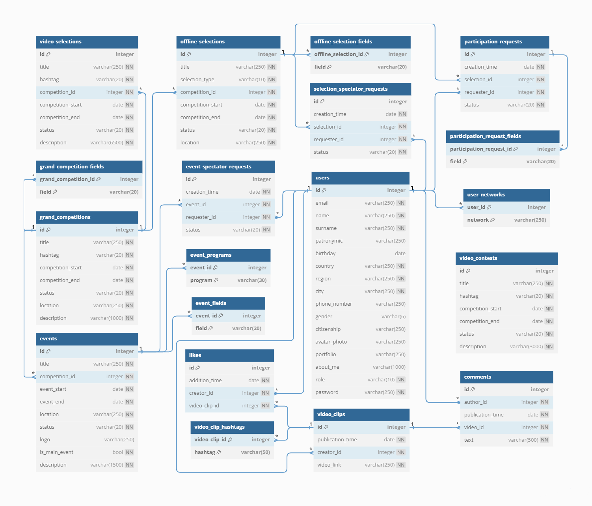

# Backend-часть для приложения Kardo
Данное приложение позволяет пользователям подавать заявки на участие в различных соревнованиях или стать зрителем в них.
Выкладывать видео-ролики, а так же комментировать и лайкать их.

_**Используемый стэк**_: Spring Boot, Spring Data JPA, Spring Security, SQL, PostgreSQL, Hibernate, Lombok, Mapstruct, 
Swagger, Flyway.

## Функциональность
Приложение представляет собой площадку, на которой размещены множество разнообразных спортивных соревнований,
как в оффлайн формате, так и в онлайн. Крупные же соревнования состоят из нескольких этапов отборов и заканчиваются 
многодневным Гранд-финалом, состоящим из множества различных развлекательных и спортивных мероприятий. 
Любой зарегистрированный пользователь может подать заявку на участие в них или заявку зрителя. 

API приложения разделено на две части:
- доступна только авторизованным пользователям;
- административная — для администраторов сервиса.  

Ниже приведён обобщённый список с функциями, разделённый по ролям:  
Администраторы могут:
- добавлять все соревнования, отборы и мероприятия к ним. А так же редактировать или удалять их
- менять статусы заявок пользователей, как на участие в отборах на соревнования, так и заявки зрителей на просмотр 
отборов и мероприятий
- просматривать информацию о пользователях
- просматривать и в случае необходимости удалять видео-ролики, нарушающие правила приложения
- комментировать видео-ролики, просматривать чужие комментарии и при необходимости удалять видео-ролики, 
нарушающие правила приложения  

Пользователи могут:
- регистрироваться в приложении, обновлять или удалять данные своего профиля, в т.ч. и аватарки
- оставлять заявки на участие в отборах или зрительские заявки, а так же редактировать или удалять их
- получать списки различных соревнований или мероприятий по параметрам
- выкладывать видео-ролики, а так же просматривать их, комментировать и лайкать

### Swagger (OpenAPI) Documentation
В приложение интегрирован Swagger - инструмент для написания OpenAPI документации.   
[kardo-swagger.json](kardo-swagger.json) - файл для https://editor-next.swagger.io в json формате.
Сгенерировать его можно с помощью GET запроса по адресу http://localhost:8080/v3/api-docs при запущенном приложении.
http://localhost:8080/swagger-ui/index.html - ссылка на _**swagger-ui**_.

### Инструкция по сборке и запуску  

Перед сборкой и запуском приложения необходимо внести некоторые изменения в application.properties:
 - при помощи свойства logging.file.path указать путь для хранения логов приложения;
 - при помощи свойства spring.datasource.url указать действующую БД;
 - при помощи свойства spring.datasource.username указать имя пользователя БД;
 - при помощи свойства spring.datasource.password указать пароль пользователя БД;
 - при помощи свойства folder.path указать путь для хранения медиа-файлов;

Далее необходимо собрать jar файл при помощи maven командой **mvn clean package**. Затем уже можно запустить приложение 
командой java **-jar kardo-0.0.1-SNAPSHOT.jar**.
Приложение будет доступно по адресу _https:/localhost_.

## Схема базы данных

